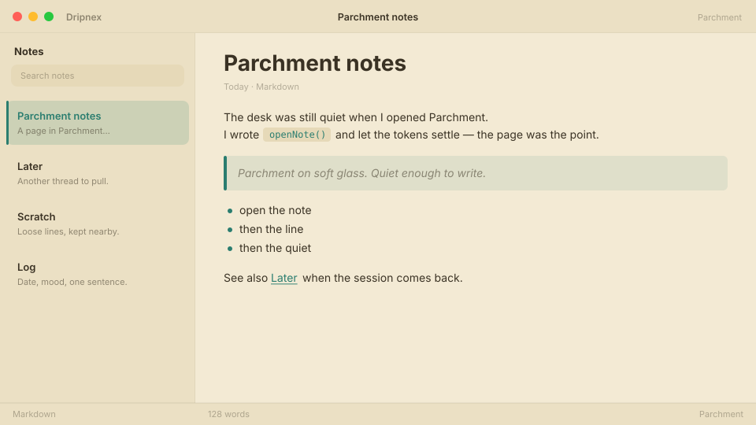

# Parchment

Warm paper for long reading sessions — cream, ink, and a little quiet.



```
dripnex/theme-parchment
```

## Palette

The chips live in [palette.html](palette.html) — open it in a browser. GitHub won’t paint HTML swatches here, so the hex list is below.

| Name | Token | Color | What it’s for |
| --- | --- | --- | --- |
| Base | `--bg-base` | `#f3ead4` | Window background |
| Surface | `--bg-surface` | `#ebe0c4` | Sidebar and chrome |
| Elevated | `--bg-elevated` | `#faf3e3` | Raised panels |
| Text | `--text-primary` | `#3a3224` | Headings and body |
| Muted | `--text-muted` | `#3a3224 · rgba(58, 50, 36, 0.52)` | Secondary copy |
| Accent | `--accent` | `#2a7d6f` | Selection and links |
| Active | `--status-active` | `#2a7d6f` | Active status |
| Dropped | `--status-dropped` | `#c44b4b` | Dropped status |

The same palette is Dripnex’s official default; this repo is the installable copy. Pick it when you want notes that feel like a well-loved notebook.
